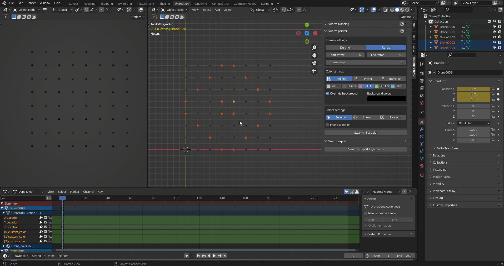

# FlyinDiamonds

## Planning

### Swarm area
- define and check area for swarm

### Swarm initialize
- initialize drones

### Swarm distance
- check minimal distance between drones

### Swarm speed
- check maximal horizontal and vertical drones speed

## Swarm plan
- plan transition of drones to object vertices/faces

### Selection
- select which drones to plan for from all drones, selected drones in scene, drones from group
- more about groups <https://github.com/FlyinDiamonds/blender_addon#groups>

### Check collisions
- keeps minimal distance between drones

### Same mesh
- plans on same object
- does not check distance between drones

### Plan to target
- plan to vertices/faces of selected object

## Frames

### Frame duration
- calculates given number of frames starting with your current frame

### Frame range
- calculates frames in selected range

### Frame step
- number of frames to step over during calculation
- can be used to control intensity of blinking with selecting random drones or for better performance with selecting by mesh

## Colors

### Color pallete
- color pallete for quick access to often used colors

### Color picker
- color picker for ather colors

### Color transition
- two pickers to calculate color transition on

### Override background
- if checked colors on drones which are not selected are overriden with selected color

- if unchecked colors on drones which are not selected will stay as they are

## Select

### Select mouse
- drones selected in viewport are used

### Select by mesh
- drones which are in picked mesh are used

### Select random
- select random drones on each step

### Select group
- select items in active group
- more about groups <https://github.com/FlyinDiamonds/blender_addon#groups>

### Invert selection
- drones which are not selected are used

## Groups

### Create group
- create empty drone group
- group can be named

### Remove group
- remove group

### Move group
- move group by arrows fro better organization

## Group items

### Add
- adds empty item with object picker

### Remove
- remove item from group

### Move
- move item in group

### Add selected
- adds items for selected drones

### Remove selected
- remove selected drones from group

### Select
- selects drones in group

### Deselect
- deselects drones in group

